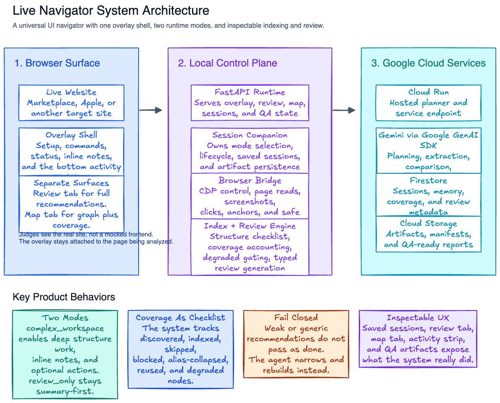
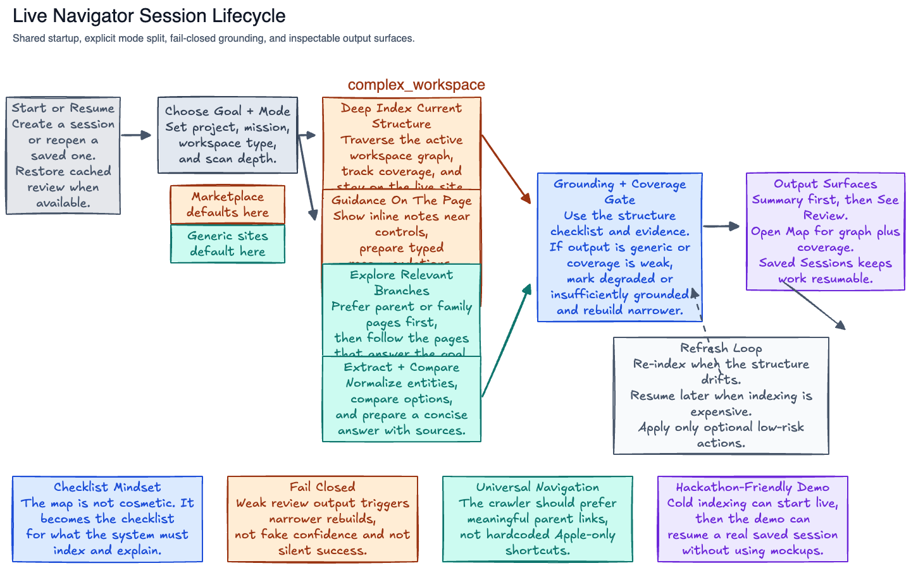

# Live Navigator Architecture

Live Navigator Companion is a hybrid UI navigator. The browser stays local, the planning stack can run on Google Cloud, and the product surface stays inside the live site instead of forcing the user into a separate dashboard.

The easiest way to understand it is with two diagrams:
- system architecture, which shows where each piece runs
- session lifecycle, which shows how indexing, review, live notes, and resume fit together

## System Architecture

Exported artifact:
- `docs/diagrams/live_navigator_system_architecture.png`

What this diagram is saying:
- The operator works inside the real website, not in a fake mock environment.
- The overlay, review tab, and map tab are separate surfaces over the same session state.
- The local FastAPI app owns bootstrap, UI routes, and command endpoints.
- The session companion owns mode, review readiness, coverage, saved artifacts, and resume behavior.
- The browser bridge owns Chrome CDP attachment, overlay injection, tab focus, screenshot capture, and command execution.
- The grounding pipeline turns the live page into model-usable context using screenshots first, then visible UI and AX or DOM summaries.
- The Google Cloud side is where hosted memory and planning can live: Cloud Run, Firestore, Cloud Storage, and Gemini or Vertex AI through the Google GenAI SDK.

## Session Lifecycle

Exported artifact:
- `docs/diagrams/live_navigator_session_lifecycle.png`

What this diagram is saying:
- Every session starts in one of two runtime modes.
- `complex_workspace` is for Marketplace-like systems. It builds a structure checklist, tracks coverage, fails closed on implausibly thin crawls, then enables full review and optional live notes.
- `review_only` is for simpler public websites. It explores relevant pages, extracts comparable entities, then produces a concise answer and a full review tab without default executable actions.
- Saved sessions are part of the core architecture, not an add-on. Resume, re-index, and partial refresh are expected behavior.

## Components And Features

### 1. Browser Surface

This is what the operator actually sees.

Features:
- in-page overlay shell
- `Index Site First`
- `See Review`
- `Saved Sessions`
- bottom activity strip
- `View Map` into the coverage graph
- full review tab

Why it exists:
- It keeps the workflow inside the real site.
- It avoids the "agent in one window, app in another" problem.

### 2. Runtime Modes

The architecture branches after session creation.

`complex_workspace`:
- deep structure-aware indexing
- coverage accounting
- degraded coverage fail-closed behavior
- inline live notes near relevant controls
- detailed grouped review
- optional executable actions

`review_only`:
- focused exploration
- entity extraction and comparison
- summary-first output
- no default inline notes
- no default executable batch

### 3. Structure Intelligence

This is one of the actual moats in the project.

Features:
- normalized structure manifest
- current editable area focus
- Marketplace hierarchy synthesis from quarter, tab, and parent resource
- coverage states: discovered, indexed, skipped, blocked, alias-collapsed
- degraded coverage detection
- partial refresh vs full refresh

Why it matters:
- The system is not just scraping pages.
- It is keeping a checklist of what the site structure appears to be, and using that checklist to decide whether a review is trustworthy.

### 4. Review And Guidance Layer

This is where user-visible value is generated.

Features:
- typed review items
- grouped review sections
- evidence snippets
- page and anchor hints
- live notes in complex mode
- rendered review tab for detailed inspection
- map and coverage tab for crawl inspection

Why it matters:
- It turns raw crawl results into actionable guidance instead of generic commentary.

### 5. Safe Execution

Execution is intentionally not the whole product.

Features:
- local browser control through CDP
- structured action execution
- confirmation gating for risky actions
- review-first default behavior
- no destructive auto-submit path

Why it matters:
- The system stays useful even when action confidence is low.
- It can assist without pretending it should autonomously click through every workflow.

### 6. Google Cloud Layer (Optional)

This is the optional hosted backend for remote planning and persistence.

Features:
- Cloud Run backend
- Firestore session memory
- Cloud Storage artifacts
- Gemini or Vertex AI planning path
- Google GenAI SDK integration

Why it matters:
- It gives the local browser runtime a hosted memory and planning option without moving browser control off the operator machine.

## Why This Architecture Fits The Product

This project is strongest when it is framed as:
- a universal UI navigator
- optimized for dense recurring workspaces
- with a lighter review-only path for simpler sites

That means the architecture should emphasize:
- local grounding
- structure-aware indexing
- inspectable coverage
- resumable sessions
- review-first guidance
- safe optional execution
- Google Cloud backed planning and memory (optional)

Those are the real product features. The earlier one-diagram version buried too many of them inside tiny labels.
